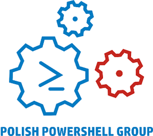

{: .align-center}
## I'm a co-founder of Polish PowerShell User Group. 

This started as a dream in 2016. Together with [Tomasz Dabrowski](https://dombrosblog.wordpress.com/) and [Pawel Jarosz](https://paweljarosz.wordpress.com/) aided by Kasia Pieter - we got together a few people to share PowerShell passion with. 

Since then we had the honor to guest Jeffrey Snover, Bartka Bielawskiego, Jakub Jares and many more.

Although we are located in Wroclaw, we can visit your city.

We meet every month, thanks to hospitality of [Objectivity](https://www.objectictivity.co.uk) in our offices at Strzegomska 142a. We also try to stream on [YouTube](https://www.youtube.com/channel/UCZDODEgPGNC3UMAWeHEzc-A) and do Live session through Skype for Business.

# Contact details

Our [Meetup](https://www.meetup.com/Polish-PowerShell-Group-PPoSh/) space is always with updated information about all events

Here are also a few ways you can contact us:
- Slack - [http://bit.ly/PPoSh-Slack](http://bit.ly/PPoSh-Slack) (auto-invite form)
- GitHub - [https://github.com/pposhgroup](https://github.com/pposhgroup) - with our modules and slides
- FaceBook - [https://www.facebook.com/PPoShGroup](https://www.facebook.com/PPoShGroup) - for those who use it
- Twitter - [@Arcontar](https://twitter.com/Arcontar), [@Dom_Bros](https://twitter.com/Dom_Bros), [@Kasia_PPOSH](https://twitter.com/Kasia_PPOSH)

